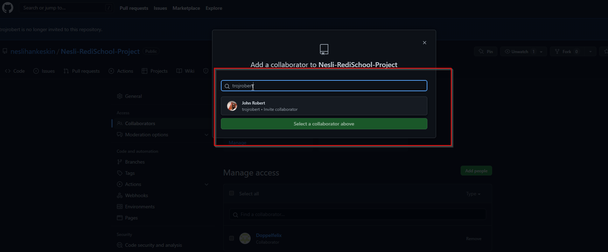

# How to collaborate with git
1. Ask for the username of the person you're inviting as a collaborator.  
2. Open your browser and go to your github account. Open the repository that you created with the homework.  eg. https://github.com/neslihankeskin/Nesli-RediSchool-Project

2. Under your repository name, click Settings. In the left sidebar, click Collaborators. (Note: if you do not see the collaborators, then because you repository was set as a private)

3. Under Manage access, click add people and type your collaborator’s github username.
Select the collaborator's username from the drop-down menu. Click Add collaborator.

4. Afterwards, you will see the status of your invitation.

5. The user will receive an email inviting them to the repository. Once they accept your invitation, they will have collaborator access to your repository.
